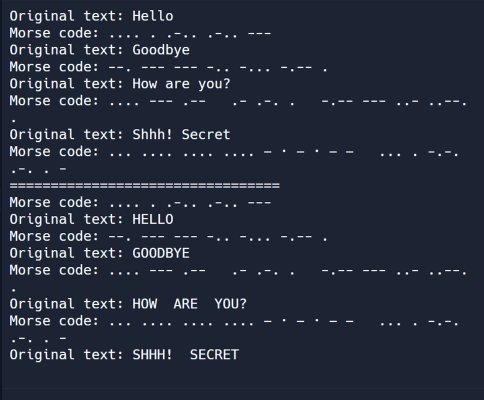

# Aim 🏍️

- This repository is the extended version of [Activity: A (micro)Bit of Radio Security](https://github.com/uwe-cyber/micro-bit_of_radio_security).
- The overview of this [UWE - CyberWest Teacher Workshops](https://github.com/uwe-cyber/teachersworkshop2024/blob/main/lesson-microbitradiosecurity.md) can be viewed via the link.

### 🍵 Brief

- Students will use the micro:bits to communicate with each other via radio. Initial communication will be done as a broadcast and in plaintext.
- Students will then work through the use of pairing and “encrypted” communication.
- The second exercise will then illustrate the use of pairing with Caesar ciphers.
- These exercises have been designed to cover the importance of secure communication and use of coding within cyber security.

---

### ❇️ Already experienced with micro:bits?

Please go to the "Start the Game! 🤖" section below. It's time for fun!

### ✳️ Prerequisites

- 3 x BBC micro:bits(v2) as a sender, a receiver and a scanner (virtual micro:bits are also available in the microbit.org Python editor!)
- Basic knowledge of Python and the micro:bit

### ✅ How to get familiar with Python and Micro-bit?

- To find out more about Python for the micro:bit, visit: [https://microbit.org/code/](https://microbit.org/code/)
- More Python? [W3School](https://www.w3schools.com/python/default.asp) is your good friend.

---

# How to start? 🛼

### 🛹 Method 1

1. Download the hex file in this repository
2. **Drag and drop the hex** file into the micro:bit folder
    - "Plaintext_broadcast_morse_code.hex" is for both the receiver and the sender. More info is under the section "Task 1".
    - "Scanner.hex" is for the scanner (A.K.A. Man-in-the-middle), which can intercept all communication without alerting the sender and the receiver.

### 🛴Method 2

1. Go to [https://microbit.org/code/](https://microbit.org/code/)
2. Open Python Editor
3. Copy and paste the code into the Python editor
4. Press the "Save" button on the lower right-hand side (.hex). You can choose to download either the Python or hex file (the latter is set by default)
5. Connect the micro:bit via USB and drag the hex file into its folder
6. Wait for the micro:bit LED to stop flashing and have fun 🤞

---

# Start the Game! 🤖

## 🏀 Task 1 - Morse code in paired communication

Think about what you can do to find the real message...

- What does each character represent in Morse code? (Hint: They are all upper-case!)
- Space between each Morse code means... ?
- How to translate Morse code into the English alphabet?

### How to play?

1.  &nbsp;Press B to start the "Pairing" process on micro:bit #1
3.  &nbsp;Press A & B to complete pairing once the "+" symbol is displayed on micro:bit #2
4.  &nbsp;Press A to type Morse Code (micro:bit A), then
    - Press A to type '.' (Dot)
    - Press B to type '-' (Dash)
    - Touch Logo to type ' ' (Space)
    - Shake micro:bit A 🫨 OR Press 'A & B', so you can see all the message you type manually. It's a good way to review the massage before sending it.
    - Move micro:bit A towards the ground slowly to send the decrypted message
    - Move micro:bit A to the right to send the encrypted message

### 🍧 Have fun with Morse code

The following sample illustrates how Morse code works.

#### 🔗 Links

1. &nbsp; [Replit - Morse Code Converter](https://replit.com/@iceueb/morse-code?v=1)  

2. &nbsp; [International Morse](https://morsecode.world/international/morse2.html)  
   This is the reference we used for morse code.

## 🏀 Task 2 - Cracking Caesar Ciphers

In this task, the sender micro:bit will pair with a receiver and choose a message to encrypt with a Caesar cipher. The other device will receive the 
ciphertext over radio.

### How to play?

1. Build **caesar_cipher.py** or drop the pre-built **caesar_cipher.hex** file onto both micro:bits to start.
2. Follow the first two steps in **Task 1 - How to Play** to pair the devices.
3. Press A to cycle through messages on micro:bit #1. Decide which one you would like to send and press B while it is scrolling.
4. The receiver will read the ciphertext on their device and try to find the key. Alternatively, the sender can share the key only with the receiver in advance.
   Cracking the cipher can be done manually or by using an online tool such as Cryptii or CyberChef:
    https://cryptii.com/pipes/caesar-cipher
    https://gchq.github.io/CyberChef/
  
A decryption function is included in the code, but its result is not displayed by the micro:bit. You may uncomment lines 94-96 in **caesar_cipher.py** to also 
scroll the decrypted text depending on the aims and objectives of your lesson. You may also change the Caesar cipher shift value in these functions. You will need 
to generate a new hex file in either case.

5. Next, a third micro:bit equipped with scanner code will attempt to intercept the sender and receiver's radio group, as well as the messages
   they are exchanging. The third participant does not know the key and will have to look into ways of finding this out!

6. Once the task is finished, examine the code for a closer look into the way the cipher is implemented. 

## 🚨 Troubleshooting
### Q1. The hex file doesn't work. / The microbit shows random characters or memory error
### Ans: 
1. Press the button on the back of the microbit to reset it. 
2. Go to [Micro:bits Python Editor Online](https://python.microbit.org/v/3), and paste any python file in the editor, then save the hex file to the microbit you use. 
